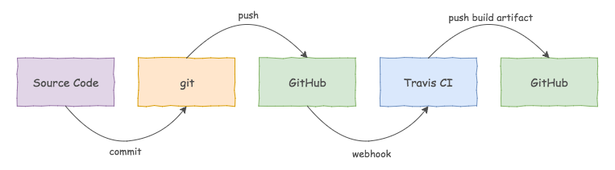

[](https://travis-ci.org/garystafford/voter-service) [](https://app.updateimpact.com/latest/817200262778327040/voter-service) [](https://microbadger.com/images/garystafford/voter-service "Get your own image badge on microbadger.com") [](https://microbadger.com/images/garystafford/voter-service "Get your own version badge on microbadger.com")

# Voter Service

## Introduction

The Voter [Spring Boot](https://projects.spring.io/spring-boot/) Service is a RESTful Web Service, backed by [MongoDB](https://www.mongodb.com/). The Voter service exposes several HTTP API endpoints, listed below. API users can review a static list candidates (based on the 2016 US Presidential Election), submit a vote, view voting results, and inspect technical information about the running service. API users can also create random voting data by calling the `/simulation` endpoint.

The Voter service is designed to work along with the [Candidate Service](https://github.com/garystafford/candidate-service), as part of a complete API. The Voter service is dependent on the Candidate service to supply a list of candidates. The Candidate service is called by the Voter service, using [HTTP-based synchronous IPC](https://www.nginx.com/blog/building-microservices-inter-process-communication/), when either the Voter service's `/candidates` or `/simulation` endpoints are called.

## Quick Start for Local Development

The Voter service requires MongoDB to be running locally, on port `27017`. The Voter service also required the Candidate service to be running locally on `8097`. To clone, build, test, and run the Voter service as a JAR file, locally:

```bash
git clone --depth 1 --branch master \
  https://github.com/garystafford/voter-service.git
cd voter-service
./gradlew clean cleanTest build
java -jar build/libs/voter-service-0.2.0.jar
```
## Quick Start with Docker
There is a `docker-compose.yml` file included in the project. The compose file will spin up single container instances of the Voter service, Candidate service, and MongoDB.

```bash
docker-compose up -d
```

```text
CONTAINER ID        IMAGE                                   COMMAND                  CREATED             STATUS              PORTS                                                                                                                                                                            NAMES
c7b23aaf7af6        garystafford/voter-service:0.2.101      "java -Dspring.pro..."   8 hours ago         Up 8 hours          8097/tcp, 0.0.0.0:8099->8099/tcp                                                                                                                                                 voterservice_voter_1
0d4d3006f012        garystafford/candidate-service:0.2.27   "java -Dspring.pro..."   8 hours ago         Up 8 hours          0.0.0.0:8097->8097/tcp                                                                                                                                                           voterservice_candidate_1
13b8670790cf        mongo:latest                            "/entrypoint.sh --..."   8 hours ago         Up 8 hours          0.0.0.0:27017->27017/tcp                                                                                                                                                         voterservice_mongodb_1
```

## Getting Started with the API
The easiest way to get started with the Candidate and Voter services API, using [HTTPie](https://httpie.org/) from the command line:  
1. Create sample candidates: `http http://localhost:8097/simulation`  
2. Create sample voter data: `http http://localhost:8099/simulation`  
3. View sample voter results: `http http://localhost:8099/results`

## Service Endpoints

By default, the service runs on `localhost`, port `8099`. By default, the service looks for MongoDB on `localhost`, port `27017`.

Purpose                                                                                                                  | Method  | Endpoint
------------------------------------------------------------------------------------------------------------------------ | :------ | :-----------------------------------------------------
Create Random Sample Data                                                                                                | GET     | [/simulation](http://localhost:8099/simulation)
List Candidates                                                                                                          | GET     | [/candidates](http://localhost:8099/candidates)
Submit Vote                                                                                                              | POST    | [/votes](http://localhost:8099/votes)
View Voting Results                                                                                                      | GET     | [/results](http://localhost:8099/results)
View Total Votes                                                                                                         | GET     | [/results/votes](http://localhost:8099/results/votes)
View Winner(s)                                                                                                           | GET     | [/winners](http://localhost:8099/winners)
View Winning Vote Count                                                                                                  | GET     | [/winners/votes](http://localhost:8091/winners/votes)
Service Info                                                                                                             | GET     | [/info](http://localhost:8099/info)
Service Health                                                                                                           | GET     | [/health](http://localhost:8099/health)
Service Metrics                                                                                                          | GET     | [/metrics](http://localhost:8099/metrics)
Other [Spring Actuator](http://docs.spring.io/spring-boot/docs/current/reference/htmlsingle/#production-ready) endpoints | GET     | `/actuator`, `/mappings`, `/env`, `/configprops`, etc.
Other [HATEOAS](https://spring.io/guides/gs/rest-hateoas) endpoints for `/votes`                                         | Various | DELETE, PATCH, PUT, page sort, size, etc.

The [HAL Browser](https://github.com/mikekelly/hal-browser) API browser for the `hal+json` media type is installed alongside the service. It can be accessed at `http://localhost:8099/actuator/`.

## Voting

Submitting a new vote, requires an HTTP `POST` request to the `/votes` endpoint, as follows:

HTTPie

```text
http POST http://localhost:8099/votes \
candidate="Jill Stein (Green Party)"
```

cURL

```text
curl -X POST \
  -H "Content-Type: application/json" \
  -d '{ "candidate": "Jill Stein (Green Party)" }' \
  "http://localhost:8099/votes"
```

wget

```text
wget --method POST \
  --header 'content-type: application/json' \
  --body-data '{ "candidate": "Jill Stein (Green Party)" }' \
  --no-verbose \
  --output-document - http://localhost:8099/votes
```

## Sample Output

Using [HTTPie](https://httpie.org/) command line HTTP client.

`http http://localhost:8099/simulation`

```json
{
    "message": "simulation data created"
}
```

`http http://localhost:8099/candidates`

```json
{
    "candidates": [
        "Chris Keniston (Veterans Party)",
        "Darrell Castle (Constitution Party)",
        "Donald Trump (Republican Party)",
        "Gary Johnson (Libertarian Party)",
        "Hillary Clinton (Democratic Party)",
        "Jill Stein (Green Party)"
    ]
}
```

`http http://localhost:8099/results`

```json
{
    "results": [
        {
            "candidate": "Jill Stein (Green Party)",
            "votes": 18
        },
        {
            "candidate": "Darrell Castle (Constitution Party)",
            "votes": 17
        },
        {
            "candidate": "Chris Keniston (Veterans Party)",
            "votes": 16
        },
        {
            "candidate": "Gary Johnson (Libertarian Party)",
            "votes": 15
        },
        {
            "candidate": "Donald Trump (Republican Party)",
            "votes": 7
        },
        {
            "candidate": "Hillary Clinton (Democratic Party)",
            "votes": 7
        }
    ]
}
```

`http http://localhost:8099/results/votes`

```json
{
    "votes": 80
}
```

`http http://localhost:8099/winners`

```json
{
    "results": [
        {
            "candidate": "Jill Stein (Green Party)",
            "votes": 18
        }
    ]
}
```

`http http://localhost:8099/winners/votes`

```json
{
    "votes": 18
}
```

`http POST http://localhost:8099/votes candidate="Jill Stein (Green Party)"`

```json
{
    "_links": {
        "self": {
            "href": "http://localhost:8099/votes/5888605326b6f40371a1d016"
        },
        "vote": {
            "href": "http://localhost:8099/votes/5888605326b6f40371a1d016"
        }
    },
    "candidate": "Jill Stein (Green Party)"
}
```

## Continuous Integration

The project's source code is continuously built and tested on every commit to [GitHub](https://github.com/garystafford/voter-service), using [Travis CI](https://travis-ci.org/garystafford/voter-service). If all unit tests pass, the resulting Spring Boot JAR is pushed to the `build-artifacts` branch of the [voter-service](https://github.com/garystafford/voter-service/tree/build-artifacts) GitHub repository. The JAR's filename is incremented with each successful build (i.e. `voter-service-0.2.10.jar`).



## Spring Profiles

The Voter service includes several Spring Boot Profiles, in a multi-profile YAML document: `src/main/resources/application.yml`. The profiles are `default`, `docker-development`, `docker-production`, and `aws-production`. You will need to ensure your MongoDB instance is available at that `host` address and port of the profile you choose, or you may override the profile's properties.


```yaml
server:
  port: 8099
spring:
  data:
   mongodb:
     host: localhost
     port: 27017
     database: voters
logging:
 level:
   root: INFO
info:
 java:
   source: ${java.version}
   target: ${java.version}
management:
 info:
   git:
     mode: full
   build:
     enabled: true
services:
  candidates:
    host: localhost
    port: 8097
---
spring:
 profiles: docker-development
 data:
   mongodb:
     host: mongodb
services:
  candidates:
    host: candidates
---
spring:
 profiles: aws-production
 data:
   mongodb:
     host: 10.0.1.6
logging:
 level:
   root: WARN
management:
 info:
   git:
     enabled: false
   build:
     enabled: false
endpoints:
 sensitive: true
 enabled: false
 info:
   enabled: true
 health:
   enabled: true
services:
  candidates:
    host: candidates
---
spring:
 profiles: docker-production
 data:
   mongodb:
     host: mongodb
logging:
 level:
   root: WARN
management:
 info:
   git:
     enabled: false
   build:
     enabled: false
endpoints:
 sensitive: true
 enabled: false
 info:
   enabled: true
 health:
   enabled: true
services:
  candidates:
    host: candidates
```

All profile property values may be overridden on the command line, or in a `.conf` file. For example, to start the Voter service with the `aws-production` profile, but override the `mongodb.host` value with a new host address, you might use the following command:

```bash
java -jar <name_of_jar_file> \
  --spring.profiles.active=aws-production \
  --spring.data.mongodb.host=<new_host_address>
  -Djava.security.egd=file:/dev/./urandom
```

## References

- [Spring Data MongoDB - Reference Documentation](http://docs.spring.io/spring-data/mongodb/docs/current/reference/html/)
- [Accessing MongoDB Data with REST](https://spring.io/guides/gs/accessing-mongodb-data-rest/)
- [Spring Boot Testing](http://docs.spring.io/spring-boot/docs/current/reference/htmlsingle/#boot-features-testing)
- [Installing Spring Boot applications](https://docs.spring.io/spring-boot/docs/current/reference/html/deployment-install.html#deployment-install)
- [Externalized Configuration](https://docs.spring.io/spring-boot/docs/current/reference/html/boot-features-external-config.html)
- [2016 Presidential Candidates](http://www.politics1.com/p2016.htm)
